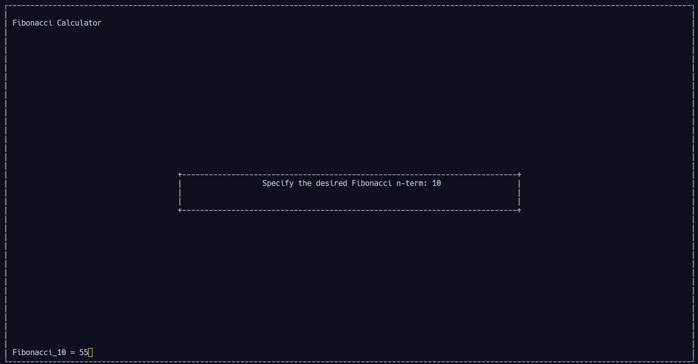

# Fibonacci calculator in C

This is a simple C program that can compute a $F_n$ term of the Fibonacci Sequence.

```c
/*

 
 !███████╗██╗██████╗  ██████╗ ███╗   ██╗ █████╗  ██████╗ ██████╗██╗
 !██╔════╝██║██╔══██╗██╔═══██╗████╗  ██║██╔══██╗██╔════╝██╔════╝██║
 !█████╗  ██║██████╔╝██║   ██║██╔██╗ ██║███████║██║     ██║     ██║
 !██╔══╝  ██║██╔══██╗██║   ██║██║╚██╗██║██╔══██║██║     ██║     ██║
 !██║     ██║██████╔╝╚██████╔╝██║ ╚████║██║  ██║╚██████╗╚██████╗██║
 !╚═╝     ╚═╝╚═════╝  ╚═════╝ ╚═╝  ╚═══╝╚═╝  ╚═╝ ╚═════╝ ╚═════╝╚═╝
                                                                  
							 
  ?█████╗ ███╗   ██╗██████╗ 
 ?██╔══██╗████╗  ██║██╔══██╗
 ?███████║██╔██╗ ██║██║  ██║
 ?██╔══██║██║╚██╗██║██║  ██║
 ?██║  ██║██║ ╚████║██████╔╝
 ?╚═╝  ╚═╝╚═╝  ╚═══╝╚═════╝ 
                           
 
 
 ToDo███╗   ██╗ ██████╗██╗   ██╗██████╗ ███████╗███████╗███████╗   ██╗  ██╗
 ToDo████╗  ██║██╔════╝██║   ██║██╔══██╗██╔════╝██╔════╝██╔════╝   ██║  ██║
 ToDo██╔██╗ ██║██║     ██║   ██║██████╔╝███████╗█████╗  ███████╗   ███████║
 ToDo██║╚██╗██║██║     ██║   ██║██╔══██╗╚════██║██╔══╝  ╚════██║   ██╔══██║
 ToDo██║ ╚████║╚██████╗╚██████╔╝██║  ██║███████║███████╗███████║██╗██║  ██║
 ToDo╚═╝  ╚═══╝ ╚═════╝ ╚═════╝ ╚═╝  ╚═╝╚══════╝╚══════╝╚══════╝╚═╝╚═╝  ╚═╝
                                                                       
 


*/

//* ┌──────────────────────────────────────────────────┐
//* │ Include tne ncurses.h and the string.h libraries.│   
//* └──────────────────────────────────────────────────┘

#include <ncurses.h>
#include <string.h>


//* ┌──────────────────────────────────────────────────┐
//* │ Recursive Function for the Fibonacci Sequence    │   
//* └──────────────────────────────────────────────────┘

int Fibonacci(int n){
	
	if(n <= 1){
		
		return n;
		
	}else{
	
		return Fibonacci(n - 1) + Fibonacci(n - 2);
	}
	
}

int main(){
	
//* ┌──────────────────────────────────────────────────┐
//* │ Variable declaration and initial window message. │   
//* └──────────────────────────────────────────────────┘

	char message[] = "Specify the desired Fibonacci n-term: ";
	int n, rows, columns;

//* ┌──────────────────────────────────────────────────┐
//* │ Initialize the ncurses screen                    │   
//* └──────────────────────────────────────────────────┘

	initscr();

//* ┌──────────────────────────────────────────────────┐
//* │ Store the size of the window                     │   
//* └──────────────────────────────────────────────────┘

	getmaxyx(stdscr, rows, columns);

//* ┌───────────────────────────────────────────────────────────────┐
//* │ Create a subwindow for the initial message and the user input │   
//* └───────────────────────────────────────────────────────────────┘

	int subwin_rows = (rows / 2)/4;
    int subwin_columns= columns / 2;
    int subwin_y = (rows - subwin_rows) / 2;
    int subwin_x = (columns - subwin_columns) / 2;
    WINDOW *message_win = subwin(stdscr, subwin_rows, subwin_columns, subwin_y + 1 , subwin_x);
	WINDOW *result_win = subwin(stdscr, subwin_rows, subwin_columns, subwin_y + 1 , subwin_x);

//* ┌───────────────────────────────────────────────────────────────┐
//* │ Specify the style of the borders and corners of both windows  │  
//* │ and print them on screen.                                     │ 
//* └───────────────────────────────────────────────────────────────┘

	box(stdscr,'|', '-');
	wborder(message_win, '|', '|', '-', '-', '+', '+', '+', '+');
	wrefresh(message_win);
	refresh();

//* ┌───────────────────────────────────────────────────────────────────────┐
//* │ Print the program title, the initial message and get the user input   │ 
//* └───────────────────────────────────────────────────────────────────────┘

	mvprintw(2,2, "Fibonacci Calculator");
	mvprintw(rows/2, (columns - strlen(message))/2, "%s", message);
	scanw("%d",&n);

//* ┌─────────────────┐
//* │ Show the result │ 
//* └─────────────────┘
	mvprintw(LINES -2, 2, "Fibonacci_%d = %d", n, Fibonacci(n));

	getch();
	delwin(message_win);
	endwin();

	return 0;
}

```

```html
 ┌───────────┐
 │  Output   │ 
 └───────────┘
```

